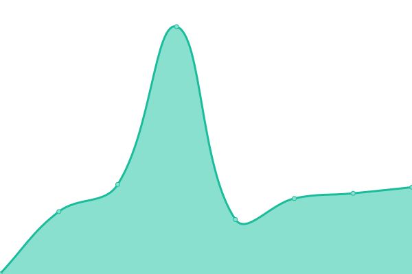
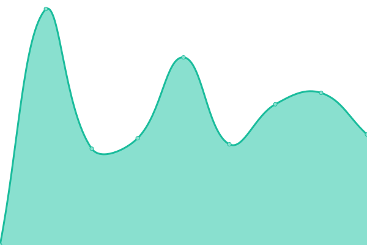
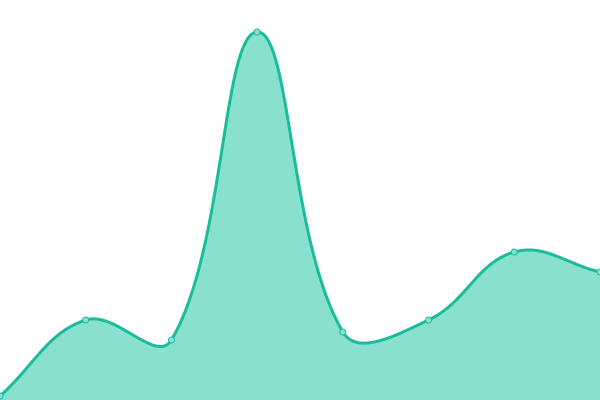

# [📈 Live Status](https://s.lynnguo666.site): <!--live status--> **🟧 Partial outage**

This repository contains the open-source uptime monitor and status page for [lynnguo666-person](https://s.lynnguo666.site), powered by [Upptime](https://github.com/upptime/upptime).

With [Upptime](https://upptime.js.org), you can get your own unlimited and free uptime monitor and status page, powered entirely by a GitHub repository. We use [Issues](https://github.com/lynnguo666-person/serverceshi/issues) as incident reports, [Actions](https://github.com/lynnguo666-person/serverceshi/actions) as uptime monitors, and [Pages](https://s.lynnguo666.site) for the status page.

<!--start: status pages-->
<!-- This summary is generated by Upptime (https://github.com/upptime/upptime) -->
<!-- Do not edit this manually, your changes will be overwritten -->
<!-- prettier-ignore -->
| URL | Status | History | Response Time | Uptime |
| --- | ------ | ------- | ------------- | ------ |
|  [AliYun BeiJing](http://182.92.195.102) | 🟩 Up | [ali-yun-bei-jing.yml](https://github.com/lynnguo666-personal/serverceshi/commits/HEAD/history/ali-yun-bei-jing.yml) | 

 1362ms
     
 | 

<a href="https://s.lynnguo666.site/history/ali-yun-bei-jing">100.00%</a>
    

|  [Euserv V2Ray Server](https://eu01.apilg6.ml) | 🟥 Down | [euserv-v2-ray-server.yml](https://github.com/lynnguo666-personal/serverceshi/commits/HEAD/history/euserv-v2-ray-server.yml) | 

 0ms
     
 | 

<a href="https://s.lynnguo666.site/history/euserv-v2-ray-server">0.00%</a>
    

|  [Euserv Web Server](https://eu301920cf.apilg6.ml) | 🟥 Down | [euserv-web-server.yml](https://github.com/lynnguo666-personal/serverceshi/commits/HEAD/history/euserv-web-server.yml) | 

 755ms
     
 | 

<a href="https://s.lynnguo666.site/history/euserv-web-server">0.00%</a>
    

|  [Synology NAS Server](https://lynnguo666.site) | 🟥 Down | [synology-nas-server.yml](https://github.com/lynnguo666-personal/serverceshi/commits/HEAD/history/synology-nas-server.yml) | 

 0ms
     
 | 

<a href="https://s.lynnguo666.site/history/synology-nas-server">0.00%</a>
    

|  [GitHub](https://github.com) | 🟩 Up | [git-hub.yml](https://github.com/lynnguo666-personal/serverceshi/commits/HEAD/history/git-hub.yml) | 

 102ms
     
 | 

<a href="https://s.lynnguo666.site/history/git-hub">100.00%</a>
    

|  [CloudFlare](https://www.cloudflare.com) | 🟥 Down | [cloud-flare.yml](https://github.com/lynnguo666-personal/serverceshi/commits/HEAD/history/cloud-flare.yml) | 

 137ms
     
 | 

<a href="https://s.lynnguo666.site/history/cloud-flare">99.99%</a>
    

|  [US Web CN2 GIA](https://blog.lynnguo666.site) | 🟥 Down | [us-web-cn-2-gia.yml](https://github.com/lynnguo666-personal/serverceshi/commits/HEAD/history/us-web-cn-2-gia.yml) | 

 1885ms
     
 | 

<a href="https://s.lynnguo666.site/history/us-web-cn-2-gia">73.50%</a>
    

|  Secret Site | 🟥 Down | [secret-site.yml](https://github.com/lynnguo666-personal/serverceshi/commits/HEAD/history/secret-site.yml) | 

 0ms
     
 | 

<a href="https://s.lynnguo666.site/history/secret-site">0.00%</a>
    

<!--end: status pages-->

[**Visit our status website →**](https://s.lynnguo666.site)

## 📄 License

- Powered by: [Upptime](https://github.com/upptime/upptime)
- Code: [MIT](./LICENSE) © [lynnguo666-person](https://s.lynnguo666.site)
- Data in the `./history` directory: [Open Database License](https://opendatacommons.org/licenses/odbl/1-0/)
